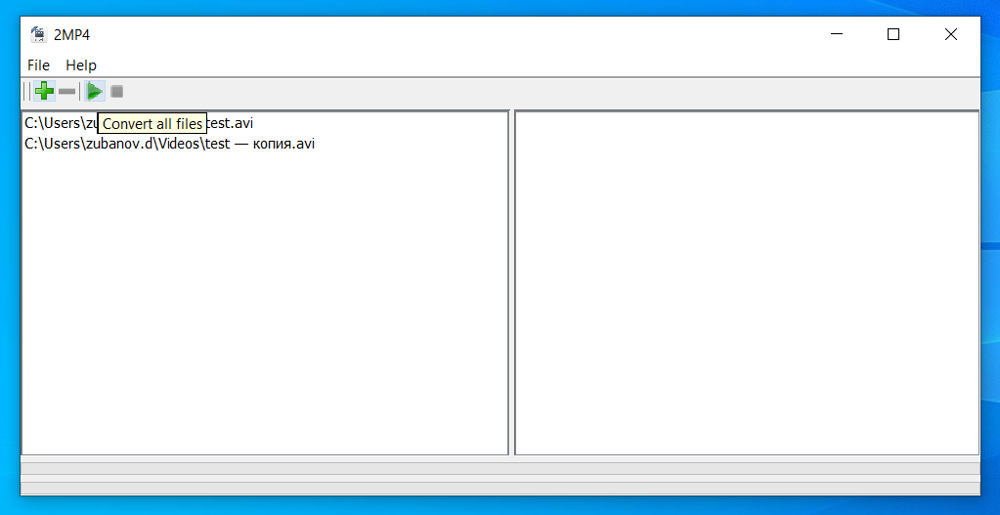

## **Welcome to 2MP4 Converter page**

2MP4 Converter it's easy to use desktop application for convert any video format to mp4, based on ffmpeg project.

[**Download last 2MP4 release (Windows)**](https://github.com/javadimon/2MP4/releases/download/v.1.0/2mp4-setup.exe)

Just add files for convert, push convert button, wait and enjoy.

Supported video formats: **avi, mov, mkv, 3gp, wmv, wm, 3g2, mpeg, vob**

